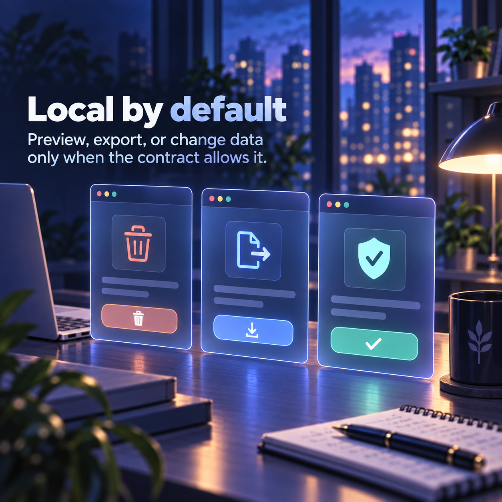

# Custom Extensions — content-system preview

> Review artifact for `TASK-0016`. This proposes a clearer public story; it does not replace `README.md`.

## Start with the everyday problem

Small browser tools are easy to make and easy to lose. **One lives in a chat, another in a downloaded ZIP, and the next session has to guess what each one can touch.** Custom Extensions gives those utilities a durable home without pretending they are one large browser product.

## What the collection is

Custom Extensions is a collection of **independently loadable Brave/Chromium utilities**. Each extension has its own manifest, implementation, tests, risk class, and installable directory under `extensions/`.

That boundary is the product decision: a site adapter can break without taking unrelated utilities down with it, and a user can load exactly one tool instead of granting a whole collection a wider reach.

## Why the boundaries matter

Browser extensions can read visible data, export it, or change it. The README should make that difference obvious before installation.

- **Read/export tools** preserve source order and say when capture may be partial.
- **Stateful tools** stay inside extension-local state unless the contract says otherwise.
- **Destructive tools** preview the target set, require confirmation, and fail closed when inputs are invalid.
- **Every extension** asks for the narrowest permissions it actually uses.

## How the repository makes that repeatable

The registry is inventory metadata, not a runtime dependency. The collection test runner executes each extension's own tests. The packager creates **one versioned ZIP per registered extension**, checks manifest/registry agreement, and writes checksums for release inspection.

The evidence labels stay honest: `LOCAL_TESTED` means deterministic checks passed; `LIVE_SMOKE_REQUIRED` means a real Brave/Chromium run is still needed. **Packaging is not the same thing as proving a live site adapter works.**

## What is here today

The current registry includes a ChatGPT 10-Day Cleaner, a LinkedIn Connection Exporter, and a ChatGPT Transcript Exporter. Each has a narrow purpose and its own verification story; the collection does not collapse them into a shared browser runtime.

## Read before adding another extension

Start with `AGENTS.md`, `HANDOFF.md`, `docs/POLICIES.md`, the PDD/SDD, and `extensions/registry.json`. Then add the target extension's manifest, README, specs, implementation, tests, and registry entry. **If two extensions merely look similar, duplicate a small helper first; promote shared runtime code only after repeated semantic reuse is real.**

## Review questions

- Can a first-time reader explain what to install and where?
- Are privacy, permissions, risk, and evidence states visible without reading every paragraph?
- Does the story make the collection boundary feel useful rather than bureaucratic?
- Does the image title orient the user without turning the visual into a noisy dashboard?

## Contract used

This preview pins `content-generation-modules@0.1.2` at `cb8c18fa7789e4b651e1f963892bf056b0d3276d`. Canonical repository files remain unchanged until review.
